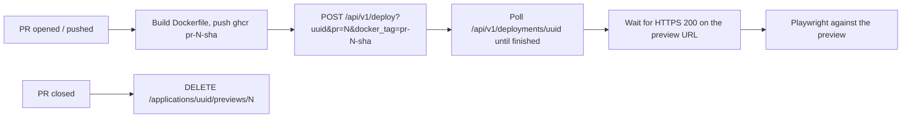

# Pull request previews on Coolify

Every pull request gets a throwaway deployment of the **production image**, on the
production host, behind its own HTTPS URL. The end-to-end suite then runs against
that URL, so a green check means "this build boots and works in production", not
"it compiled".

Workflow: [`.github/workflows/pr-preview.yml`](../.github/workflows/pr-preview.yml).

## How it works

The image is the one the release pipeline ships: same `Dockerfile`, same
`node ace build`, same runtime stage. Only the architecture differs — previews
build `linux/amd64` only, releases also build `linux/arm64`.

Coolify creates the preview record itself when `docker_tag` is passed together
with `pr`, so nothing has to exist in Coolify before the first PR. That path is
only available for applications whose build pack is **Docker Image**; see
"Prerequisites".

## Prerequisites

1. **The Coolify application must use the `Docker Image` build pack**, pointing at
   `ghcr.io/thomasevano/musickeeper`. If it is a Git-based application instead,
   the API answers `docker_tag can only be used with Docker Image applications`;
   in that case either switch the application to Docker Image, or drop the CI
   build and use Coolify's native GitHub App preview deployments (which rebuild
   on the server from the PR branch — slower, and not the released artifact).

2. **The application needs an FQDN** (e.g. `https://musickeeper.app`). Coolify
   derives the preview host from it.

3. **Preview URL template**: in the application's `Preview Deployments` settings,
   set the template to something deterministic, e.g. `pr-{{pr_id}}.{{domain}}`.
   Do **not** use `{{random}}` — CI computes the URL from the same template and
   would not be able to guess a random segment.

4. **Wildcard DNS**: `*.musickeeper.app` → the Coolify host, so `pr-42.…`
   resolves and Traefik can issue a certificate for it.

5. **Environment variables**: mark every variable the preview needs (`APP_KEY`,
   `PORT`, `LOG_LEVEL`, `NODE_ENV`, `SESSION_DRIVER`, `MB_APP_CONTACT_EMAIL`) as
   _available for preview deployments_ in Coolify. The app has no database, so a
   preview is fully disposable — nothing to seed, nothing to migrate.

6. **Registry access**: the GHCR package must be pullable by the Coolify host —
   public, or added as a registry credential in Coolify.

## Repository configuration

Secrets (`Settings → Secrets and variables → Actions → Secrets`):

| Name                | Value                                                                               |
| ------------------- | ----------------------------------------------------------------------------------- |
| `COOLIFY_API_URL`   | Base URL of the Coolify instance, e.g. `https://coolify.example.com` (no `/api/v1`) |
| `COOLIFY_API_TOKEN` | API token from `Keys & Tokens → API tokens`, scoped to the team owning the app      |
| `COOLIFY_APP_UUID`  | UUID of the production application (visible in its Coolify URL)                     |

Variables (same page, `Variables` tab):

| Name                           | Value                                                                                 |
| ------------------------------ | ------------------------------------------------------------------------------------- |
| `COOLIFY_PREVIEW_URL_TEMPLATE` | `https://pr-{{pr_id}}.musickeeper.app` — must match the Coolify template, with scheme |

## Behaviour

- **Push to a PR** rebuilds and redeploys. The image tag embeds the head SHA
  (`pr-42-a1b2c3d`), so Coolify always pulls a new artifact instead of a stale
  cached tag.
- **Concurrency** is per PR with `cancel-in-progress`, so rapid pushes do not
  queue up deployments.
- **Fork PRs are skipped** — they have no access to the secrets. Nothing is
  deployed and no job fails.
- **Closing or merging a PR** deletes the preview (containers, volumes, record).
  The `pr-N-sha` images stay in GHCR; `GITHUB_TOKEN` cannot delete package
  versions. Prune them manually or with a scheduled job using a PAT that has
  `delete:packages`.

## Failure modes worth recognising

| Symptom                                                                                     | Cause                                                                                           |
| ------------------------------------------------------------------------------------------- | ----------------------------------------------------------------------------------------------- |
| `Coolify rejected the deploy request (HTTP 400)` with `docker_tag requires pull_request_id` | `pr` was dropped from the query — check the workflow inputs                                     |
| `docker_tag can only be used with Docker Image applications`                                | Prerequisite 1 is not met                                                                       |
| Deployment reaches `finished` but the URL never answers 200                                 | Missing wildcard DNS, or template mismatch between Coolify and `COOLIFY_PREVIEW_URL_TEMPLATE`   |
| Container restarts on boot                                                                  | A preview-scoped env var is missing; `src/infrastructure/env.ts` validates at startup and exits |

## API reference used

- `POST /api/v1/deploy?uuid=&pr=&docker_tag=` — queue a preview deployment
- `GET /api/v1/deployments/{uuid}` — status: `queued`, `in_progress`, `finished`, `failed`, `cancelled-by-user`
- `DELETE /api/v1/applications/{uuid}/previews/{pull_request_id}` — tear down
