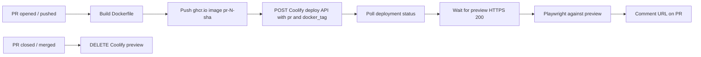

# Pull request previews on Coolify

This document is the reproducible record for the MusicKeeper pull-request
preview system. It describes the implementation, the Coolify configuration,
the GitHub configuration, the verification path, and the failures encountered
while bringing it online.

The canonical workflow is
[`.github/workflows/pr-preview.yml`](../.github/workflows/pr-preview.yml).

## Outcome

For every eligible pull request, GitHub Actions now:

1. Builds the same production Dockerfile used by the release image.
2. Pushes a PR-specific image to GHCR.
3. Deploys that exact image to a dedicated Coolify Docker Image application.
4. Waits for Coolify to finish the deployment.
5. Waits for the preview URL to answer HTTP 200.
6. Runs the Playwright end-to-end suite against the deployed preview.
7. Comments the preview URL and image tag on the pull request.
8. Deletes the Coolify preview when the pull request closes or merges.

The result is a production-image smoke test, not just a build test.

## Architecture



The preview image uses the repository `Dockerfile` and the same production
build path as the release image. Release builds produce `linux/amd64` and
`linux/arm64`; previews produce `linux/amd64` because the Coolify preview host
only needs that architecture.

Coolify creates the preview deployment when both `pr` and `docker_tag` are
provided. Nothing has to be manually created for each pull request. This API
path requires the Coolify application to use the **Docker Image** build pack.

## Repository changes

### `.github/workflows/pr-preview.yml`

The workflow:

- Triggers on `opened`, `synchronize`, `reopened`, and `closed` pull requests.
- Skips fork pull requests because repository secrets are unavailable to them.
- Uses per-PR concurrency with `cancel-in-progress: true`.
- Builds and pushes `pr-<number>-<short-head-sha>` to GHCR.
- Uses a dedicated GitHub Actions cache scope: `musickeeper-preview`.
- Calls Coolify's deployment API with the PR number and Docker tag.
- Polls the deployment API for `queued`, `in_progress`, `finished`, `failed`,
  and `cancelled-by-user`.
- Waits for the resolved preview URL to return HTTP 200.
- Runs the existing Playwright suite after deployment.
- Updates one marked preview comment instead of creating a comment for every
  push.
- Deletes the preview through Coolify's API when the PR closes.

The image tag contains the commit SHA intentionally. Reusing a mutable tag
could make Coolify restart an old image from its cache.

### `playwright.config.ts`

Playwright now supports two modes:

- Without `PLAYWRIGHT_BASE_URL`, it starts the existing local development
  server on `127.0.0.1:63136`.
- With `PLAYWRIGHT_BASE_URL`, it does not start a local server and runs the
  same tests against the already deployed Coolify preview.

The workflow sets `PLAYWRIGHT_BASE_URL` to the URL produced by the deploy job.
The local mode remains unchanged for development and normal CI.

### `docs/pr-previews.md`

This document is the setup and recovery reference for the feature.

## Coolify setup

Create a dedicated Coolify application for previews. Keeping it separate from
the production application prevents preview-specific domains, image tags, and
environment settings from changing production.

### Application type

Configure the application as:

| Setting                | Value                                          |
| ---------------------- | ---------------------------------------------- |
| Build pack             | `Docker Image`                                 |
| Image                  | `ghcr.io/thomasevano/musickeeper`              |
| Exposed/container port | `8080`                                         |
| FQDN                   | The base domain used to generate preview hosts |

The exposed port must match the application container. The repository
Dockerfile exposes port `8080`. The local `docker-compose.yml` port mapping is
not used by this Docker Image deployment.

Coolify's predefined `HOST` value defaults to `0.0.0.0`. It can be set
explicitly in the preview environment if needed:

```text
HOST=0.0.0.0
```

### Preview URL template

In the Coolify application's **Preview Deployments** settings, configure a
deterministic template:

```text
pr-{{pr_id}}.{{domain}}
```

Do not use `{{random}}`. GitHub Actions must be able to derive the same URL
from the PR number.

The repository variable contains the scheme:

```text
https://pr-{{pr_id}}.musickeeper.app
```

Coolify's template and the GitHub variable must produce the same URL. A
template mismatch causes deployment to finish while the workflow polls the
wrong hostname.

### DNS and HTTPS

Create a wildcard DNS record covering the generated hosts:

```text
*.musickeeper.app → the Coolify Cloud DNS target
```

Use the exact target shown by Coolify Cloud for the application. Do not
guess an IP or use the public Coolify website domain.

Coolify must be able to issue a valid certificate for the preview hostname.
A self-signed certificate is not a successful preview; the workflow uses
normal TLS verification and will fail rather than hide that problem.

### Environment variables

This is the most important Coolify detail.

The application has two separate collections:

- **Production Environment Variables**
- **Preview Deployments Environment Variables**

The workflow sends `pr=<number>` to Coolify. That makes the deployment a
Coolify preview deployment, which reads the preview collection. Copy the
required variables into the **Preview Deployments Environment Variables**
section of the dedicated preview application.

Required runtime values:

```text
APP_KEY=<stable-preview-secret>
LOG_LEVEL=info
MB_APP_CONTACT_EMAIL=preview@example.com
SESSION_DRIVER=cookie
PORT=8080
NODE_ENV=production
HOST=0.0.0.0
```

Keep `APP_KEY` stable across redeployments, but use a preview-specific value
instead of sharing the production encryption key. `APP_KEY`, `LOG_LEVEL`,
`MB_APP_CONTACT_EMAIL`, and `SESSION_DRIVER` must be enabled as runtime
variables. They do not need to be build-time variables.

The application validates these values during startup in
`src/infrastructure/env.ts`. If they are absent from the preview collection,
the container exits before it can serve traffic.

The application stores user data in browser IndexedDB and has no runtime
database configuration. A preview therefore needs no database, migrations, or
seed data.

### GHCR access

The Coolify host must be able to pull the preview image:

```text
ghcr.io/thomasevano/musickeeper:pr-<number>-<short-sha>
```

Either make the package public or configure GHCR registry credentials in
Coolify with permission to read packages.

## GitHub configuration

Add these under **Settings → Secrets and variables → Actions**.

### Secrets

| Name                | Value                                                         |
| ------------------- | ------------------------------------------------------------- |
| `COOLIFY_API_URL`   | Base Coolify API host, without `/api/v1`                      |
| `COOLIFY_API_TOKEN` | Coolify API token for the team owning the preview application |
| `COOLIFY_APP_UUID`  | UUID of the dedicated Coolify preview application             |

`COOLIFY_API_URL` must be the Coolify dashboard/API host, not the deployed
preview domain. The workflow appends `/api/v1` itself.

The API token needs permission to:

- Trigger deployments.
- Read deployment status.
- Delete application previews.

### Repository variable

Add this under the **Variables** tab:

| Name                           | Value                                  |
| ------------------------------ | -------------------------------------- |
| `COOLIFY_PREVIEW_URL_TEMPLATE` | `https://pr-{{pr_id}}.musickeeper.app` |

The template must match the Coolify preview template after substituting the
same PR number.

## Reproduction procedure

1. Build or reuse the release-compatible `Dockerfile`.
2. Create a dedicated Coolify **Docker Image** application.
3. Set its image repository to `ghcr.io/thomasevano/musickeeper`.
4. Set the exposed port to `8080`.
5. Configure the application FQDN.
6. Configure the deterministic preview URL template.
7. Configure wildcard DNS for the preview hosts.
8. Configure valid HTTPS/certificate issuance.
9. Add the required variables to **Preview Deployments Environment
   Variables**, not only the production section.
10. Make the GHCR image readable by Coolify.
11. Create the GitHub secrets and repository variable listed above.
12. Open or update a same-repository pull request.
13. Confirm the build, deployment, HTTPS, and end-to-end jobs pass.
14. Confirm the workflow comment contains the preview URL and image tag.
15. Close the pull request and confirm the Coolify preview is deleted.

## Behaviour and lifecycle

- A PR push builds a fresh image and redeploys the preview.
- The image tag is immutable per commit: `pr-<number>-<short-sha>`.
- A later push cancels an in-progress run for the same PR.
- Fork PRs are skipped because they cannot access deployment secrets.
- The preview URL is deterministic: `pr-<number>.musickeeper.app`.
- Closing or merging a PR deletes the Coolify preview record and container.
- Preview image tags remain in GHCR after cleanup because the default
  `GITHUB_TOKEN` cannot delete package versions. Package cleanup requires a
  separate scheduled job and a token with `delete:packages`.

## Failure modes and diagnosis

| Symptom                                                      | Likely cause                                                              | Check                                                                     |
| ------------------------------------------------------------ | ------------------------------------------------------------------------- | ------------------------------------------------------------------------- |
| `docker_tag requires pull_request_id`                        | The API request omitted `pr`                                              | Check the deploy URL in the workflow                                      |
| `docker_tag can only be used with Docker Image applications` | Wrong Coolify build pack                                                  | Change the application to **Docker Image**                                |
| Missing `APP_KEY`, `LOG_LEVEL`, or other startup variables   | Values exist only in the production variable section                      | Copy them into **Preview Deployments Environment Variables** and redeploy |
| Preview container restarts immediately                       | AdonisJS startup validation failed                                        | Read Coolify container logs and compare with `src/infrastructure/env.ts`  |
| Deployment finishes but URL returns `502`                    | Container exited, wrong exposed port, or proxy cannot reach the container | Check container logs and confirm the exposed port is `8080`               |
| `self-signed certificate`                                    | Coolify has not issued the public certificate for the preview hostname    | Check wildcard DNS, domain attachment, and certificate status             |
| URL never returns `200`                                      | DNS or URL template mismatch                                              | Compare the Coolify template, GitHub variable, and resolved DNS record    |
| Image does not change after a push                           | A mutable image tag or stale cache was reused                             | Confirm the tag contains the current PR head SHA                          |
| GHCR pull fails                                              | Package is private and Coolify has no registry credentials                | Make the package public or add a read-only registry credential            |
| Fork PR does not deploy                                      | Expected security behavior                                                | Use a same-repository PR or provide a separate trusted deployment path    |

When debugging, distinguish these states:

1. **Build failed**: GitHub could not create or push the image.
2. **Deployment failed**: Coolify rejected the request or the container failed.
3. **Deployment finished but HTTP failed**: DNS, TLS, port, or proxy routing.
4. **HTTP passed but E2E failed**: the deployed application or test contract
   is broken.

## Verification record

The implementation was verified with:

- The preview Docker image build and GHCR push.
- Coolify deployment status polling.
- HTTPS readiness polling against the generated preview URL.
- The full Playwright suite against the deployed production image.
- Preview cleanup through the PR close path.

The initial deployment failure was useful: Coolify reported a finished
deployment, but the container logs showed missing preview environment
variables. The fix was to populate the dedicated application's
**Preview Deployments Environment Variables** section. After that correction,
the complete workflow became green.

## Useful references

- [Coolify environment variables](https://coolify.io/docs/knowledge-base/environment-variables)
- [Coolify API authorization](https://coolify.io/docs/api-reference/authorization)
- [Coolify GitHub integration](https://coolify.io/docs/applications/ci-cd/github/overview)
- [Workflow implementation](../.github/workflows/pr-preview.yml)
- [Playwright configuration](../playwright.config.ts)
